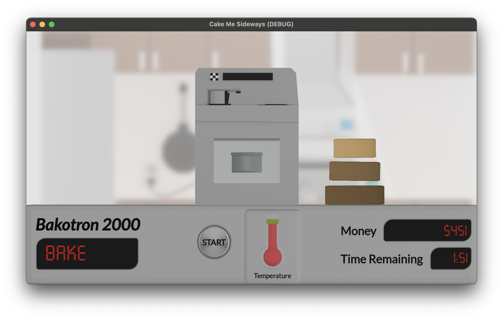

# Cake Me Sideways

Play at https://milkmanjohn.itch.io/cake-me-sideways.

Made for [Untitled Game Jam 90](https://itch.io/jam/untitled-game-jam-90)

Built in Godot 4.2.

## Credit

Kitchen by sirkitree, CC-BY, via Poly Pizza.

Lato by Łukasz Dziedzic, OFL, via Google Fonts.

Seven Segment by Onur Cem TAN via cdnfonts.com.

Hungarian Dance No. 5 by Internet Archive.

Button by deleted\_user\_2104797, CC-0, via freesound.org.

Bell Ding by 5ro4, CC-0, via freesound.org.

Dropping, Wood, C by InspectorJ, Attribution 4.0, via freesound.org.

Pyotr Ilyich Tchaikovsky, CC0, via Wikimedia Commons.

5 Minute Timer by jtkeyva, CC0, via freesound.org.

Clock Tick by Sauli, CC0, via freesound.org.

Hand Bells, G, Single by InspectorJ, CC0, via freesound.org.

Cha Ching by creek23, Attribution NonCommercial 4.0, via freesound.org.
